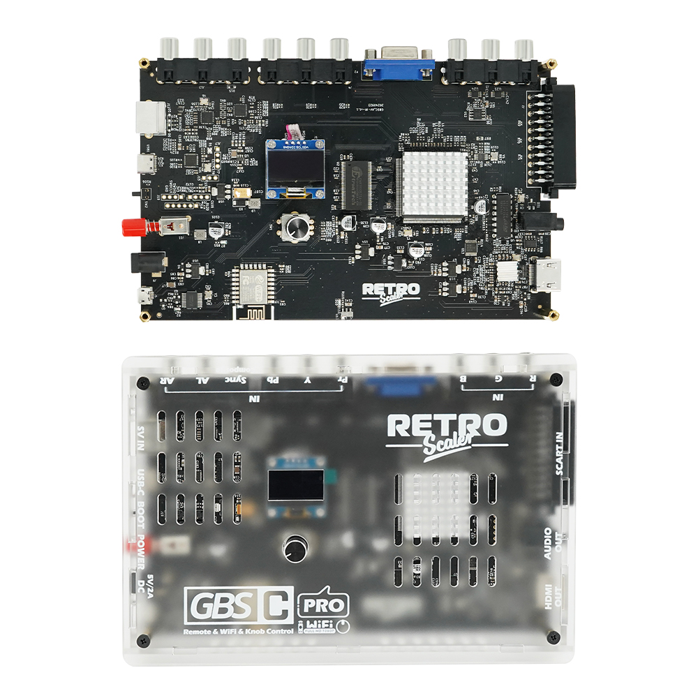

<p align="center">
    
</p>

---

Custom firmware for the GBSC-Pro video upscaler by **Brisma**.

Converts retro console video signals to HDMI up to 1080p with low latency, advanced color processing, and extensive customization options.

Based on [RetroScaler/gbsc-pro](https://github.com/RetroScaler/gbsc-pro), which is a fork of [gbs-control](https://github.com/ramapcsx2/gbs-control) by ramapcsx2.

## Links

[Manual](https://www.retroscaler.com/?page_id=480) | [Discord](https://discord.com/invite/2MMWRkVRbk) | [Video Tutorial](https://www.youtube.com/playlist?list=PLQ6X-Dl0NtDnZm5v3n3IgvNOSrBsg7s7T)

## Features

### Video Input
- **S-Video** and **Composite** (active processing via ADV7280)
- **RGB**: RGBS, RGsB, RGBHV with auto sync detection
- **Component** (YPbPr)
- **VGA** passthrough

### Video Output
- HDMI up to **1080p**
- Multiple output resolutions: 480p, 720p, 960p, 1024p, 1080p

### Image Processing
- **I2P (Interlace to Progressive)**: Motion-adaptive deinterlacing
- **ACE (Adaptive Contrast Enhancement)**: Dynamic contrast/saturation
- **Video Filters**: Shaping filter, comb filter, CTI for S-Video/Composite
- **Scanlines**: Adjustable intensity and style
- **BCSH**: Brightness, Contrast, Saturation, Hue control
- **ADC Gain**: Y/U/V gain with persistent settings
- **Color standard**: ITU-R BT.601 compliant

### User Interface
- **TV OSD**: On-screen display via STV9426 (4 themes: Classic, Dark, Light, Retro)
- **OLED Menu**: IR remote with key repeat support
- **Web UI**: WiFi-based control panel
- **36 Profile Slots**: A-Z, 0-9 with per-input settings
- **Developer menu**: Advanced hardware settings and I2C commands

### System
- **Auto-switching**: Automatic input detection
- **Low latency**: Real-time signal processing
- **Preset system**: Save/load complete configurations
- **Volume control**: PT2257 audio IC support

## Components

### [gbs-control/](gbs-control/)
**ESP8266 firmware** - Main controller running on the ESP8266. Handles the TV5725 video scaler, TV OSD (STV9426), OLED menu with IR remote, web interface, and communicates with the ADV controller via UART.

### [adv-controller/](adv-controller/)
**HC32F460 firmware** - Secondary controller managing the ADV7280 (video decoder for S-Video/Composite) and ADV7391 (video encoder). Receives commands from the ESP8266 and controls the ADV chips via I2C.

### [adv-manager/](adv-manager/)
**Python GUI** - Desktop application for debugging ADV7280/ADV7391 registers via serial connection. Useful for testing video processing settings without reflashing firmware.

### [hardware/](hardware/)
**Hardware resources** - PCB design files (Gerber), BOM, datasheets for all ICs, and an ADV CLI simulator for testing without physical hardware.

## Building

```bash
# ESP8266 firmware
cd gbs-control && pio run

# HC32 firmware
cd adv-controller && make

# Web interface
cd gbs-control/public && npm run build
```

## Hardware

Pre-assembled kits available at [Official Store](https://www.aliexpress.com/item/3256808268415575.html).

Or [build it yourself](hardware/gerber/) using the open-source design files.



## Community

[Create an issue](https://github.com/brisma/gbsc-pro/issues/new) or join the [Discord](https://discord.com/invite/2MMWRkVRbk).

## Thanks

- [@ramapcsx2](https://github.com/ramapcsx2) for [gbs-control](https://github.com/ramapcsx2/gbs-control)
