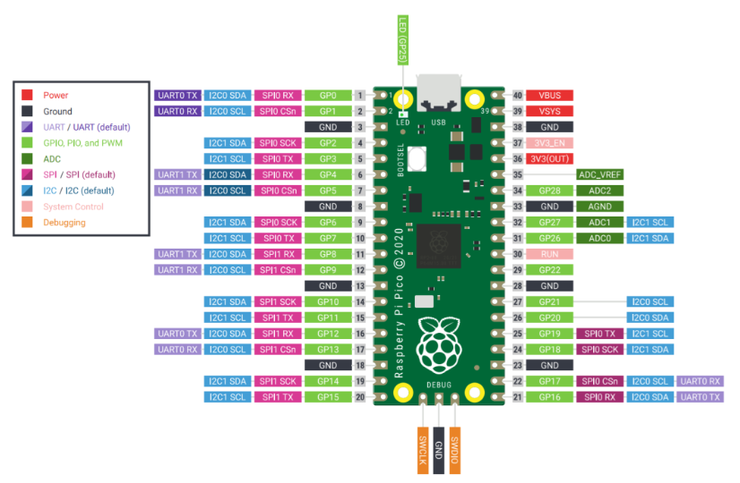
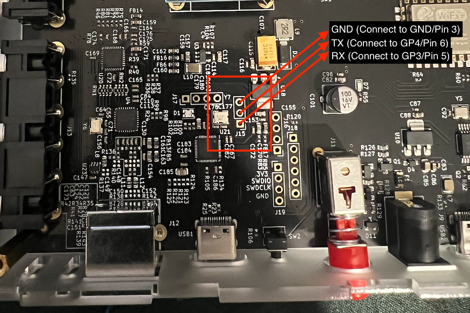
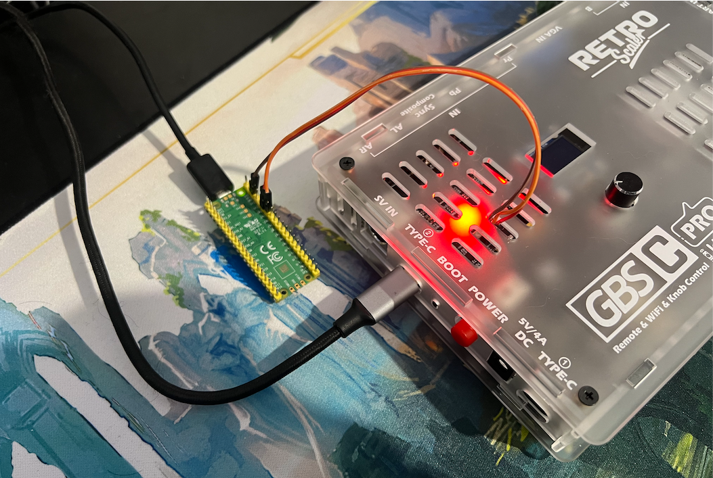
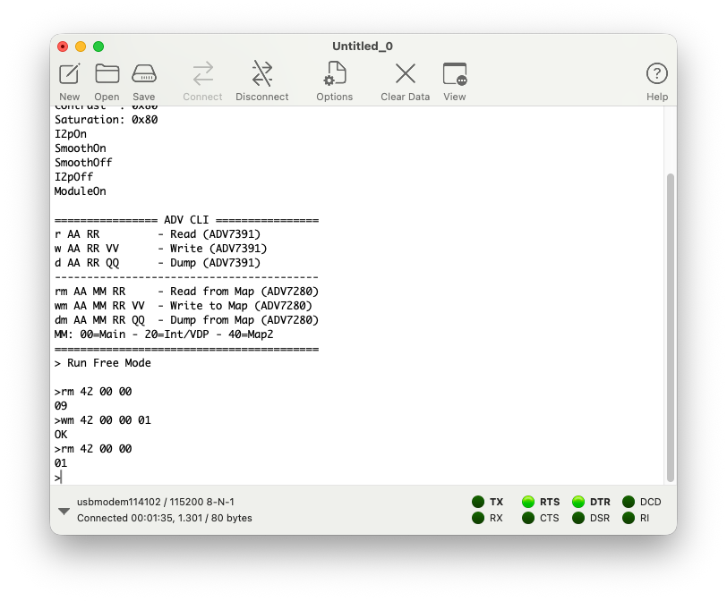
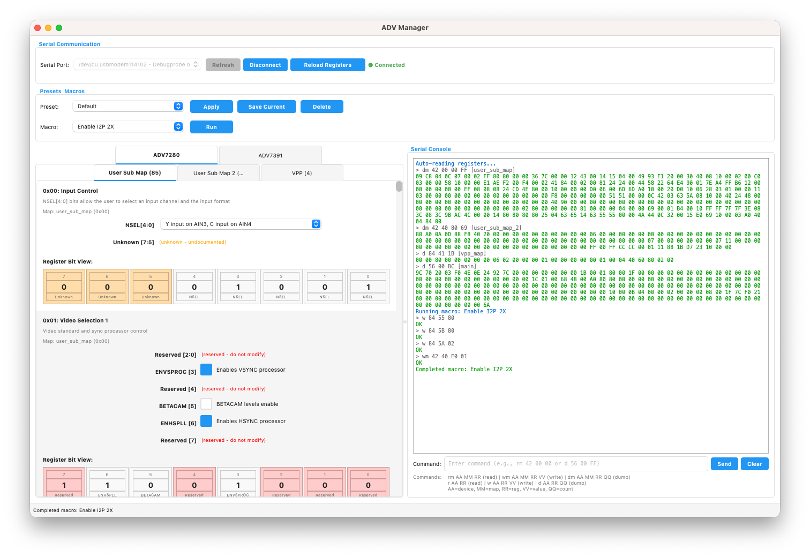
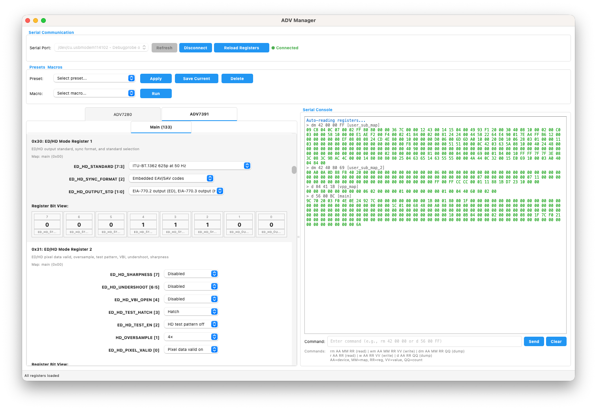

# ADV Manager

GUI application for debugging **ADV7280** (Video Decoder) and **ADV7391** (Video Encoder) registers via serial connection.

Part of the [GBSC-Pro custom firmware](../README.md) by Brisma.


## Features

- **Intuitive GUI** - Easy-to-use interface built with PyQt6
- **Live Register Editing** - Real-time read/write of device registers
- **Bit-Level Visualization** - See individual bits and their field assignments
- **Preset Management** - Save and load complete register configurations
- **Macro Support** - Execute sequences of register operations
- **Access Sequences** - Automatic handling of special register access requirements
- **Multi-Device Support** - Manage both ADV7280 and ADV7391 devices
- **Serial Communication** - Thread-safe serial communication that doesn't block the UI
- **YAML Configuration** - Human-readable configuration files

## Warnings
The project is still in progress and requires certain skills.

You will need to perform 3 soldering operations and flash the firmware of the AV module of the GBS-C Pro and the Raspberry Pico (or use any other device that allows you to create a serial connection with your PC).

In short, this project is intended for a technical audience that knows what it is doing.

I accept no responsibility for any damage you may cause to your devices. For my part, I will publish all the sources and modifications I have made to achieve this result so that you can evaluate and try out what I have experimented with.

During my tests, I always used a MacBook Pro M1, but since the application is written in Python, it should also run smoothly on Linux and Windows.

I would like to point out that the application was heavily developed using Claude Code (I wanted to try it out in a real-world scenario :D) and therefore may exhibit unexpected behavior and sudden crashes. If this happens, I would appreciate your support in helping me debug and improve the project.

## Why this project? What is its purpose?

This project stems from the need to understand how the firmware of the AV module of the GBS-C Pro developed by RetroScaler works.

Over the months, more and more problems have been highlighted regarding output formats (e.g., NTSC video formats cropped to 1X).

Given the lack of support from RetroScaler, I wanted to try to fix the various problems, and to do so, I needed a quick and easy way to “reprogram” the decoders/encoders on the device without reflashing the firmware at every test.

The decoder (ADV7280) and encoder (ADV7391) have multiple configurations that can be modified using their registers, so the aim of this project is to have a quick and easy way to test and debug the various configurations.

The datasheets used as reference for the various registers can be consulted at the following links:
- [ADV7280 Hardware Reference Manual](https://www.analog.com/media/en/technical-documentation/user-guides/adv7280_7281_7282_7283_ug-637.pdf)
- [ADV7391 Datasheet](https://www.analog.com/media/en/technical-documentation/data-sheets/ADV7390_7391_7392_7393.pdf)

In the future, if solutions are found through registry configuration, it may also be possible to correct the firmware :)

## Hardware Prerequisites

In order to use ADV Manager, we will need special **firmware on the AV module**, as well as **a very simple hardware modification** on the **GBS-C Pro** and a device that allows us to create a serial connection.

In my case, I used a simple **Raspberry Pico**, and I will use it as an example for the connections.
I am attaching its diagram for reference:



On the **Raspberry Pico**, you can use **[PicoProbe](https://github.com/raspberrypi/debugprobe/releases)** as firmware to enable bidirectional serial communication.

Simply flash the **debugprobe_on_pico.uf2** on the Raspberry Pico.

The **GBS-C Pro** has a connector called **J15**. Looking at the connector as shown in the photo, we need to make the following connections:
* **1 GND** -> **GND** of the Raspberry Pico (e.g., **Pin 3**, Pin 8, Pin 13, etc.)
* **2 TX** -> **RX** of the Raspberry Pico (**GP4 / Pin 6**)
* **3 RX** -> **TX** of the Raspberry Pico (**GP5 / Pin 7**)

Let's start with the hardware modification required for the GBS-C Pro:



Once you have made the various connections, simply connect the **Raspberry Pico** to your PC with a **USB cable** and proceed to the next step.

I am attaching a photo of my use case:



## Software Prerequisites

In order to communicate with the GBS-C Pro, you need to flash a special firmware that enables serial communication support by activating **CM_USART3** on the controller that manages the AV.

**To flash the new firmware (based on the 1.2.3 version), I recommend following the official GBS-C Pro procedure.**

The firmware implements two distinct functions:
- it creates a serial communication in which all outputs are redirected (it is now possible to see the device's debug messages)
- it implements a small CLI that allows communication with the ADV7280/ADV7391 on the I2C bus via simple commands

For example, by initiating serial communication, it is possible to manage individual device registers using special commands:



The available commands are:

```
================ ADV CLI ================
r AA RR         - Read (ADV7391)
w AA RR VV      - Write (ADV7391)
d AA RR QQ      - Dump (ADV7391)
-----------------------------------------
rm AA MM RR     - Read from Map (ADV7280)
wm AA MM RR VV  - Write to Map (ADV7280)
dm AA MM RR QQ  - Dump from Map (ADV7280)
MM: 00=Main - 20=Int/VDP - 40=Map2
=========================================
```

The parameters that can be passed are:
- AA: I2C address
- MM: map (only for ADV7280)
- RR: register
- VV: value
- QQ: quantity

All must be expressed in hexadecimal value without specifying the prefix ‘0x’.

For example:
- `rm 42 00 E3`: reads from I2C address **0x42**, from map **0x00** (User Sub Map), register **0xE3**
- `wm 42 00 E3 80`: writes the value **0x80** to I2C address **0x42**, in map **0x00** (User Sub Map), in register **0xE3**

Fortunately, ADV Manager will automatically manage all registries through a friendly visual interface :)




## Installation

### 1. Create Virtual Environment (Recommended)

```bash
python -m venv venv

# On Windows
venv\Scripts\activate

# On macOS/Linux
source venv/bin/activate
```

### 2. Install Dependencies

```bash
pip install -r requirements.txt
```

## Usage

### Starting the Application

```bash
python main.py
```

### Basic Workflow

1. **Connect to Serial Port**
   - Select your serial port from the dropdown
   - Click "Connect"

2. **Edit Registers**
   - Modify register fields
   - Changes are written automatically

3. **Use Presets**
   - Select and apply presets
   - Save current configuration as new preset

4. **Run Macros**
   - Execute register operation sequences

## Configuration Format

See `configs/adv7280.yaml` or `configs/adv7391.yaml` for examples.

## License

MIT License
